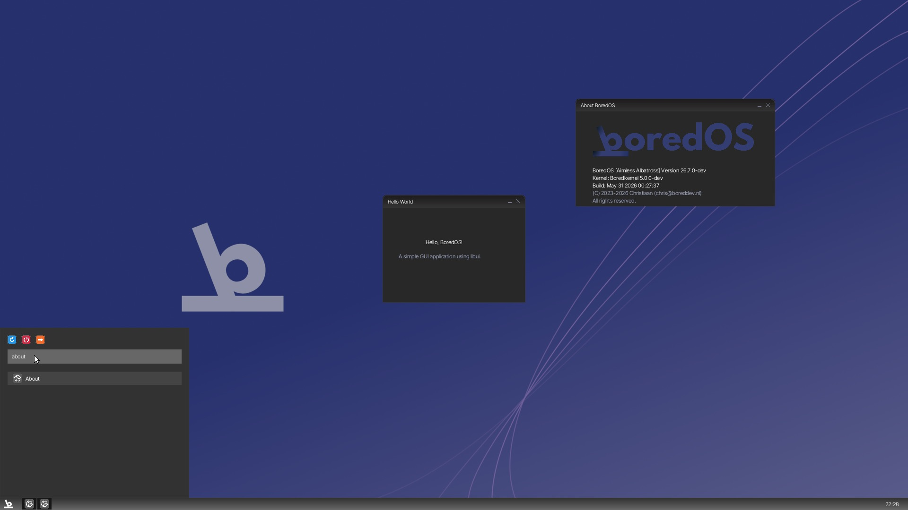

# BoredOS 

  
  
<em>A modern x86_64 hobbyist operating system built from the ground up.</em>

  
  
  
  

---

BoredOS is a x86_64 operating system featuring a custom DE, LwIP networking, SMP, FAT32 filesystem and fully functional userland.

> [!NOTE]
> *The screenshot above may represent a previous build and is subject to change as the UI evolves.*

---

## Features

### System Architecture
* **64-bit Long Mode:** Fully utilizing the x86_64 architecture.
* **Symmetric Multi-Processing (SMP):** Full support for multi-core CPUs via Limine SMP.
* **LAPIC & IPI Scheduling:** Advanced interrupt handling and inter-processor communication for task distribution.
* **SMP-Safe Spinlocks:** Robust kernel-wide synchronization for VFS, process management, and the GUI.
* **Multiboot2 Compliant:** Bootable on real hardware and modern emulators.
* **Kernel Core:** Interrupt Descriptor Table (IDT) management and a robust syscall interface.
* **Filesystem:** Full **FAT32** support for persistent and in-memory storage.
* **Networking:** Includes the lwIP networking stack and a basic web browser.

### Graphical User Interface
* **BoredWM:** A custom Window Manager with drag-and-drop, mouse-centered interaction.
* **Customization:** Adjustable UI to suit your aesthetic.
* **Media Support:** Built-in image decoding. (PNG, GIF, JPEG, TGA, BMP)

### Included Applications
* **Productivity:** GUI Text Editor calculator, Markdown Viewer, a simple browser and BoredWord.
* **Creativity:** A Paint application.
* **Utilities:** Terminal, Task Manager, File Explorer, Clock and a (limited) C Compiler.
* **Games:** Minesweeper and DOOM.

---

## 📚 Documentation

Explore the internal workings of BoredOS via our comprehensive guides in the [`docs/`](docs/) directory.

* **[Documentation Index](docs/README.md)** – Start here.
* **[Architecture Overview](docs/architecture/core.md)** – Deep dive into the kernel.
* **[Building and Running](docs/build/usage.md)** – Setup your build environment.
* **[AppDev SDK](docs/appdev/custom_apps.md)** – Build your own apps for BoredOS.

---

## Support the Journey

If you find this project interesting or helpful, consider fueling the development with a coffee!

---

## Contributors

- **BoredDevNL** — Project creator and lead maintainer.
- **Lluciocc** — Contributor.
- **Artemix1508** - Artworks.

## Project Disclaimer & Heritage

**BoredOS** is the successor to **[BrewKernel](https://github.com/boreddevnl/brewkernel)**, a project initiated in 2023. 

While BrewKernel served as the foundational learning ground for this OS, it has been officially **deprecated and archived**. It no longer receives updates, bug fixes, or pull request reviews. BoredOS represents a complete architectural reboot, applying years of lessons learned to create a cleaner, more modular, and more capable system.

> [!IMPORTANT]
> Please ensure all issues, discussions, and contributions are directed to this repository. Legacy BrewKernel code is preserved for historical purposes only and is not compatible with BoredOS.

---

## License

**Copyright (C) 2023-2026 boreddevnl**

Distributed under the **GNU General Public License v3**. See the `LICENSE` file for details. 

> [!IMPORTANT]
> This product includes software developed by Chris ("boreddevnl"). You must retain all copyright headers and include the original attribution in any redistributions or derivative works. See the `NOTICE` file for more details.
